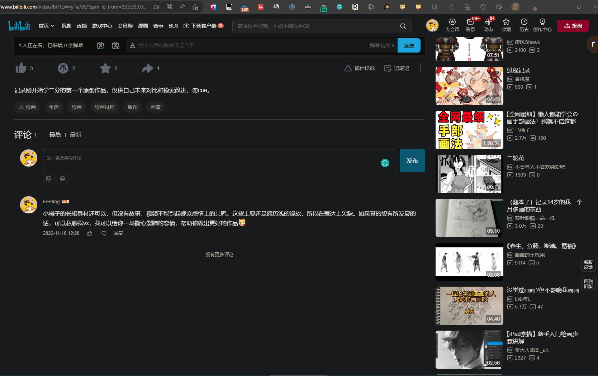

# 介绍
帮助用户快速筛选并使用评论模板进行留言，上热评，让喜爱的up迅速眼熟于你

# 设计思路
[wolai笔记记录页](https://www.wolai.com/vjJXnhH4jPrAe1KktTU84P)
# 使用

 
 
添加分组与添加评论 
 
使用别名 

# 特性

1. 自定义分组
2. 支持 B 站 4 种基础 emoji 预览，方便查看最终的评论效果
3. 复制时自动替换当前页面 的up 主名称
4. 自定义 up 主别名-----增强亲昵感

# 商店地址

[Edge浏览器](https://microsoftedge.microsoft.com/addons/detail/bilibilicommentext/bhiembdccilhmakgpgknaephfofdbjcp)
